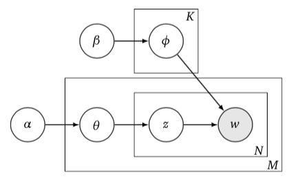

```{r setup, include=FALSE}
knitr::opts_chunk$set(echo = TRUE)
```

# The Dirichlet Distribution and its Relation to the Multinomial
Before diving into LDA, it's worth having some background on relevant probability distributions. The most relevant distributions are the categorical distribution, the multinomial distribution, and the Dirichlet distribution. 

## The categorical and multinomial distributions
First, the multinomial and categorical distributions are almost the same thing. The categorical distribution is like a Bernoulli distribution that has more than two outcomes. So, a $K$-dimensional categorical random variable will take on the value of $1$ for one of its dimensions and $0$ for the rest. 
The parameter of the categorical distribution is a $K$-dimensional vector of probabilities of each category. For example, a random variable representing a dingle role of a dice would be distributed categorical with a vector of probabilities equal to $\left[1/6, 1/6, 1/6, 1/6, 1/6, 1/6\right]$.


The multinomial distribution is a sum of categorical random variables, much like the binomial distribution is a sum of Bernoulli random variables. Instead of a $K$-dimensional vector of ones and zeros, a multinomial random variable is a vector of integers whose entries add up to $n$, the number of trials. Obviously, when $n=1$ you have a categorical distribution. 

The probability mass function of a multinomial random variable, $\vec{y}$ with parameters $n$ and $\vec{\theta}$ is below.

\begin{align}
  P(\vec{y}|\vec{\theta})
    &= \frac{n!}{\prod_{k=1}^K y_k!}\prod_{k=1}^K \theta_i^{y_k}
\end{align}


The multinomial distribution is often a good choice for modeling counts of words. In the case of LDA, our formulations have $n=1$ due to the nature of the two-step sampling process it models. (Choose a topic, now given the topic, choose a word. Repeat.) In the LDA literature, the terms "categorical distribution" and "multinomial distribution" are often conflated. But because they are equivalent when $n=1$, this (hopefully) does not cause much confusion.

## The Dirichlet distribution

The Dirichlet distribution is the multivariate form of the beta distribution. Like the beta-binomial, the Dirichlet distribution is a conjugate prior for the multinomial. Conjugacy is established in the Bayesian context when the posterior and prior have the same functional form. Conjugacy is not required for Bayesian modeling. Yet using conjugate distributions tends to simplify the algebra and can be estimated in a more computationally-efficient manner.

If $\vec{\theta}$ is a $K$-dimensional random variable which is distributed Dirichlet, with parameter $\vec{\alpha}$, then its probability density function is given by

\begin{align}
  P(\vec{\theta}|\vec{\alpha}) 
    &= \mathcal{B}(\vec{\alpha})^{-1}\prod_{k=1}^K \theta_k^{\alpha_k-1}
\end{align}

Where $\mathcal{B}(\vec{\alpha})$ is the beta function and equal to $\frac{\prod_{k=1}^K\Gamma(\alpha_k)}{\Gamma(\sum_{k=1}^K\alpha_k)}$.

The Dirichlet distribution has a few properties that (according to Geigle) will come in handy later. 

### Proof of conjugacy WRT the multinomial

Here, we show that the Dirichlet distribution is a conjugate distribution to the multinomial. 

Let $\vec{y} \sim Multinomial_K(n,\vec{\theta})$ and let $\vec{\theta} \sim Dirichlet_K(\vec{\alpha})$. Then we find the posterior distribution, $P(\vec{\theta}|\vec{y})$ is given by

\begin{align}
  P(\vec{\theta}|\vec{y})
    &= P(\vec{y}|\vec{\theta})\cdot P(\vec{\theta}|\vec{\alpha})\\
    &= \frac{n!}{\prod_{k=1}^K y_k!}\prod_{k=1}^K \theta_i^{y_k} \cdot
      \mathcal{B}(\vec{\alpha})^{-1}\prod_{k=1}^K \theta_k^{\alpha_k-1}\\
    &= \frac{n!}{\prod_{k=1}^K y_k!}\left( \prod_{k=1}^K \theta_k^{y_k} \right) \cdot
      \mathcal{B}(\vec{\alpha})\left(\prod_{k=1}^K \theta_k^{\alpha_k-1} \right)\\
    &\propto \prod_{k=1}^K\theta_k^{y_k + \alpha_k - 1}
\end{align}

Thus with a Dirichlet prior on $\vec{\theta}$, the posterior, $\vec{\theta}|\vec{y}$ is distributed $Dirichlet_K(\vec{y}+\vec{\alpha})$.

### Some other useful properties

One useful property is $\int_{\Omega} \prod_{k=1}^K\theta_k^{y_k+\alpha_k-1}d\theta = \mathcal{B}(\vec{\alpha}+\vec{y})$

proof:

Since the posterior distribution of $\vec{\theta}$ is a probability distribution, we know it integrates to $1$. Then,

\begin{align}
  \int_{\Omega} \mathcal{B}(\vec{\alpha}+\vec{y})^{-1}\prod_{k=1}^K\theta_k^{y_k+\alpha_k-1}d\theta 
    &= 1\\
  \mathcal{B}(\vec{\alpha}+\vec{y})^{-1}\int_{\Omega}\prod_{k=1}^K\theta_k^{y_k+\alpha_k-1}d\theta
    &= 1\\
  \int_{\Omega}\prod_{k=1}^K\theta_k^{y_k+\alpha_k-1}d\theta
    &= \mathcal{B}(\vec{\alpha}+\vec{y})
\end{align}

Another useful property is that the Dirichlet distribution is a member of the *exponential family* of distributions. Exponential family distributions can be written using the common form:

\begin{align}
  P(\vec{\theta}|\vec{\eta})
    &= h(\vec{\theta})exp\left\{\vec{\eta}^Tt(\vec{\theta}) - a(\vec{\eta})\right\}
\end{align}

where 

* $\eta$ is called the *natural parameter*, 
* $t(\vec{\theta})$ is a *sufficient statistic* for $\vec{\theta}$,
* $h(\vec{\theta})$ is the *underlying measure*,
* and $a(\eta)$ is the *log normalizer*.

The log normalizer is denoted as $a(\eta) = log\left(\int_{\Omega}h(\vec{\theta})exp\left\{\vec{\eta}^Tt(\vec{\theta})\right\}d\vec{\theta}\right)$.

It can be shown that the Dirichlet distribution is an exponenetial family distribution by exponentiating the log of the Dirichlet's PDF.

\begin{align}
  P(\vec\theta|\vec\alpha)
    &= \mathcal{B}(\vec\alpha)^{-1}\prod_{k=1}^K\theta_k^{\alpha_k-1}\\
  \log(P(\vec\theta|\vec\alpha))
    &= \left(\sum_{k=1}^K(\alpha_k - 1)\log(\theta_k)\right) - \log(\mathcal{B}(\vec\alpha))\\
  P(\vec\theta|\vec\alpha)
    &= exp\left\{\left(\sum_{k=1}^K(\alpha_k - 1)\log(\theta_k)\right) -
      \log(\mathcal{B}(\vec\alpha))\right\}
\end{align}

Note that:

* The natural parameter is $\eta_k = \alpha_k - 1$.
* The sufficient statistic is $t(\theta_k) = \log(\theta_k)$
* The log normalizer is $a(\vec\eta) = \log(\mathcal{B}(\vec\alpha))$

And it turns out that the derivatives of the log normalizer are the moments of the sufficient statistic:

\begin{align}
  E_p[t(\vec\theta)] &= \frac{\partial a}{\partial \vec\eta^T}
\end{align}

# Priors andConjugacy

# Latent Dirichlet Allocation

Blei originally gave two formulations for LDA and he did not state it in a pure Bayesian manner. The description below differs on both counts. We only consider the *smoothed* formulation of LDA and state it as a pure Bayesian model.

First, for clarity, let's define our indices:

* $K$ topics, indexed by $k \in \{1,2,...,K\}$
* $D$ documents, indexed by $d \in \{1,2,...,D\}$
* $V$ unique words, indexed by $v \in \{1,2,...,V\}$
* $N_d$ words in the $d$-th document, indexed by $n \in \{1,2,...,N_d\}$

The model is stated as:

\begin{align}
  \vec\phi_k
    &\sim Dirichlet_V(\vec\beta)\\
  \vec\theta_d
    &\sim Dirichlet_K(\vec\alpha)\\
  \vec{z}_{d,n}
    &\sim Multinomial_K(1,\vec\theta_d)\\
  \vec{w}_{z_{d,n}}
    &\sim Multiomial_V(1,\vec\phi_{z_{d,n}})
\end{align}

Each topic vector, $\vec\phi_k$, is a row in a $K \times V$ matrix, $\boldsymbol\Phi$. Each document vector, $\vec\theta_d$, is a row in a $D \times K$ matrix, $\boldsymbol\Theta$. The random variable $\vec{z}_{d,n}$ represents the topic of the $n$-th word sampled for the $d$-th document. The random variable $\vec{w}_{z_{d,n}}$ represents the $n$-th word sampled for the $d$-th document, coming from the $k$-th topic as selected by $\vec{z}_{d,n}$. And these variables can be collectively represented as rows of matrices $\mathbf{Z}$ and $\mathbf{W}$, respectively.

In the topic modeling literature, this model is often represented as a *plate diagram*. This type of diagram representes conditional dependencies with a directed graph. An example is in Figure 1.




The plate diagram does help make the posterior more obvious:

\begin{align}
  P(\mathbf{W}, \mathbf{Z}, \boldsymbol{\Theta}, \boldsymbol{\Phi}|\vec\alpha, \vec\beta)
    &= \prod_{n=1}^{N_d} P(w_{d,n}|\phi_{z_{d,n}}) P(z_{d,n}|\theta_d) \cdot
      \prod_{d=1}^D P(\theta_d|\alpha) \cdot \prod_{k=1}^K P(\phi_k|\beta)
\end{align}

I'll convert the $P(x|y)$ notation above to the true distributions in the next section where we derive the formula for Gibbs sampling.

# Collapsed Gibbs Sampling for LDA

Gibbs sampling is a _Markov chian Monte Carlo_ method (MCMC). MCMC methods are designed to approximate the full posterior distribution by taking samples, rather than calculating it directly. There are several popular MCMC methods. The most well-known are the Metropolis-Hastings algorithm and the Gibbs algorithm. Gibbs generally has an advantage over Metropolis-Hastings in that it is usually faster. Yet, unlike Metropolis-Hastings, Gibbs can only be used when the marginal posteriors (holding all parameters constant except the one being sampled) conform to known distributions. This is often easily acheived by using conjugate distributions. The Gibbs algorithm proceeds iteratively. At each iteration, the current value of each parameter is estimated by holding all other parameters constant at their values at the last iteration. The Gibbs algorithm can be used to estimate the parameters of an LDA model.

Gibbs sampling can be sped up by integrating out some of the parameters. (This is called "collapsing" or "collapsed Gibbs sampling".) Thus, there are fewer parameters to estimate, shortening each iteration. The collapsed sampler for LDA also generally converges faster. Because the priors over $\boldsymbol\Theta$ and $\boldsymbol\Phi$ are conjugate, these parameters can be iterated out to make a collapsed Gibbs sampler for LDA.

Note: it seems to me that integrating out $\boldsymbol\Theta$ and $\boldsymbol\Phi$ has both theoretical and practical implications. The key parameters of interest are $\boldsymbol\Theta$ and $\boldsymbol\Phi$. Though, from a frequentist perspective, $\boldsymbol\theta_d$ should be proportional to $\mathbf{z}_d$, for example. This isn't truly Bayesian (the theoretical implication), and one has to do a post-sampling normalization (the practical implication).

## Collapsing out $\boldsymbol\Theta$ and $\boldsymbol\Phi$

When we integrate $\boldsymbol\Theta$ and $\boldsymbol\Phi$ out of $P(\mathbf{W}, \mathbf{Z}, \boldsymbol\Theta, \boldsymbol\Phi|\boldsymbol\alpha, \boldsymbol\beta)$, the result is $P(\mathbf{W}, \mathbf{Z}|\boldsymbol\alpha, \boldsymbol\beta)$. Let's disect that:

By definition: 

\begin{align}
  P(\mathbf{W}, \mathbf{Z}|\boldsymbol\alpha, \boldsymbol\beta)
    &= \frac{P(\mathbf W, \mathbf Z, \boldsymbol\alpha, \boldsymbol\beta)}
      {P(\boldsymbol\alpha, \boldsymbol\beta)}\\
    &= \frac{P(\mathbf W|\mathbf Z, \boldsymbol \alpha, \boldsymbol\beta)}
      {P(\boldsymbol\alpha, \boldsymbol\beta)}\\
    &= P(\mathbf Z|\boldsymbol\alpha, \boldsymbol\beta)
      P(\mathbf W|\mathbf Z, \boldsymbol\alpha, \boldsymbol \beta)
\end{align}

And because $\mathbf Z$ is independent of $\boldsymbol\beta$ and $\mathbf W$ is independent of $\boldsymbol \alpha$,

\begin{align}
  P(\mathbf Z|\boldsymbol\alpha, \boldsymbol\beta) 
    P(\mathbf W|\mathbf Z, \boldsymbol\alpha, \boldsymbol \beta)
    &= P(\mathbf Z|\boldsymbol \alpha)P(\mathbf W|\mathbf Z, \boldsymbol\beta)
\end{align}

We can focus on $P(\mathbf Z|\boldsymbol \alpha)$ and $P(\mathbf W|\mathbf Z, \boldsymbol\beta)$ independently.

